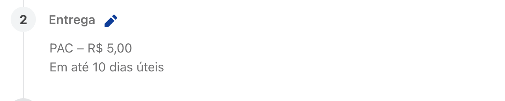
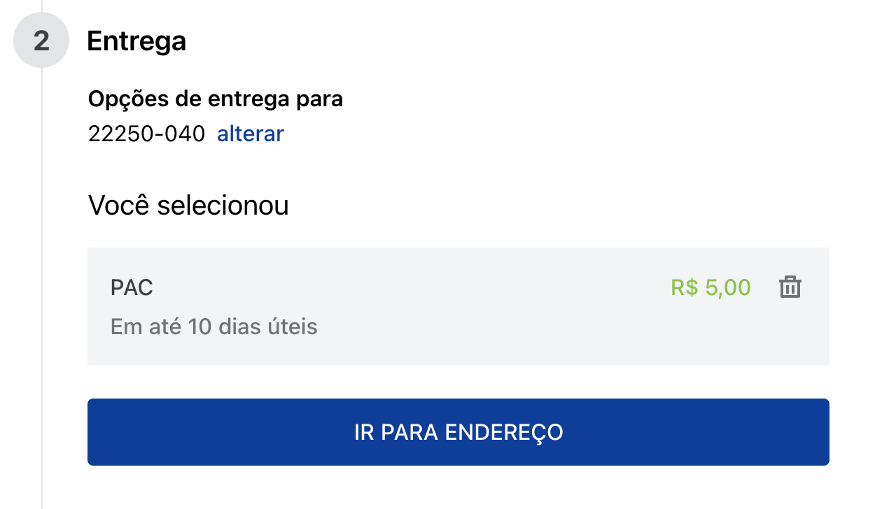
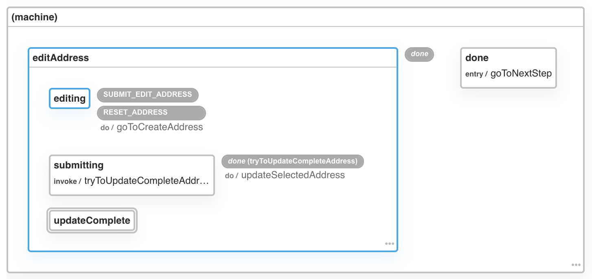

# Checkout Shipping

⚠️ **This is an ongoing, unsupported, unfinished and undocumented project. We do not guarantee any results after installation.** ⚠️

This app has the `ShippingSummary`, `AddressSummary`, `ShippingAddress` and `ShippingForm` components used in the shipping step of the checkout.




## Usage

This app is used by [`checkout-step-group`](https://github.com/vtex-apps/checkout-step-group) and shouldn't be used individually. Should you find the need to use it, you need to:

1. Add it as a dependency: `vtex add vtex.checkout-shipping`

2. Import the components in your code:

```jsx
import React from 'react'
import {
  ShippingSummary,
  ShippingForm,
  ShippingAddress,
  AddressSummary
} from 'vtex.checkout-shipping'

const MyShippingForm = ({ isPreviewMode = false }) => {
  if (isPreviewMode) {
    return (
      <ShippingSummary />
    )
  }

  return (
    // no need to pass in any props, as the component
    // uses all information provided by the `order-manager` app.
    <ShippingForm />
  )
}

const MyShippingAddress = ({ isPreviewMode = false }) => {
  if (isPreviewMode) {
    return (
      <AddressSummary />
    )
  }

  return <ShippingAddress />
}
```

Note that you need to have `OrderShippingProvider` from `vtex.order-shipping` app somewhere above these components in your tree.

## State machines

_Last updated in v0.7.0_

This app uses [XState](https://xstate.js.org/) as its state management library. Having [XState DevTools](https://github.com/amitnovick/xstate-devtools) installed really helps when debugging or developing.

Since the shipping inside checkout is comprised of two separate steps, shipping and address, we created two state machines to control each one of those steps, which we describe below.

### Shipping State Machine Diagram


The shipping has a multistep UI and its state machine has [states nodes](https://xstate.js.org/docs/guides/statenodes.html) that reflect each step of filling the shipping info.

#### 1. `initial`:

The initial state is used to determine the next state by combining [eventless transitions](https://xstate.js.org/docs/guides/transitions.html#eventless-always-transitions) (which are, in short, transitions that occur immediately) and [guarded transitions](https://xstate.js.org/docs/guides/guards.html#guarded-transitions) (conditional transitions).

In the case the user is returning to the store (there are saved addresses already), the machine transitions to `selectAddress`.

Another case is when the user was already filling the shipping information and had selected the shipping address in a previous interaction, then the machine transitions to `selectDeliveryOption`.

#### 2. `createAddress`:


#### 3. `selectAddress`:


#### 4. `selectDeliveryOption`:

This state is comprised of two sub-states, `idle` and `editing`.

##### 4.1. `selectDeliveryOption.editing`:


##### 4.2. `selectDeliveryOption.idle`:



#### 5. `done`:

The machine is in its final state and calls `goToNextStep`, which in turn may redirect the user to either address step or payment step, depending on the conditions of the purchase.

### Address State Machine Diagram



The address also has a multistep UI, similar to shipping which was explained above, but it is responsible solely to update the customer address.

#### 1. `editAddress`:


#### 2. `editReceiverInfo`:


#### 3. `done`:

The machine is in its final state and calls `goToNextStep`, which in turn redirects the user to the payment step.
