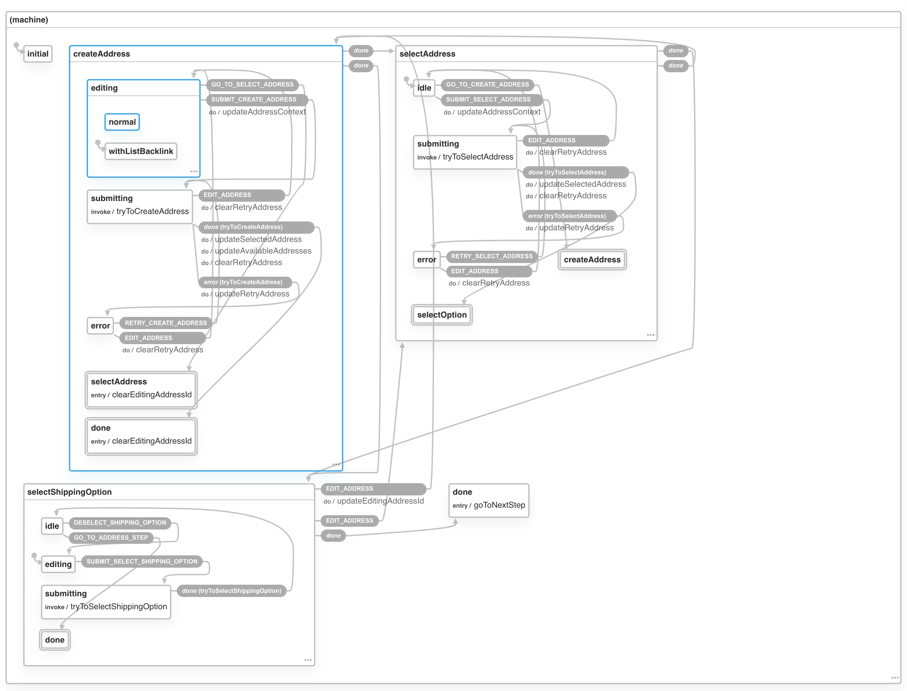
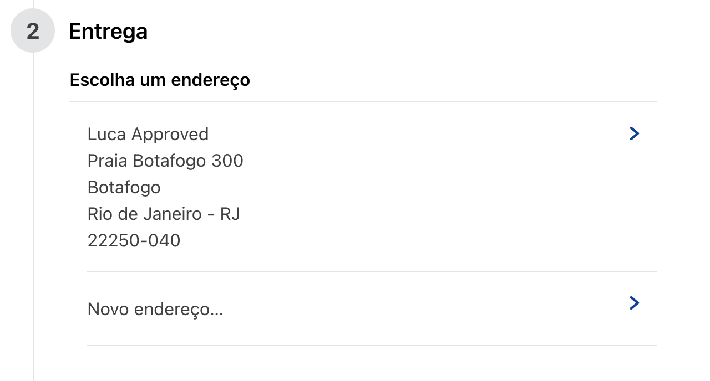
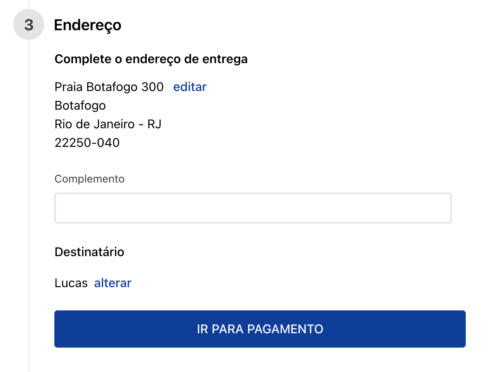

# Checkout Shipping

This app has the `ShippingSummary` and `ShippingForm` components used in the shipping step of the checkout.


## Usage

This app is used by [`checkout-step-group`](https://github.com/vtex-apps/checkout-step-group) and shouldn't be used individually. Should you find the need to use it, you need to:

1. Add it as a dependency in your `manifest.json`:
```json
{
  "dependencies": {
    "vtex.checkout-shipping": "0.x"
  }
}
```

2. Import the components in your code:

```jsx
import React from 'react'
import { ShippingPreview, ShippingForm } from 'vtex.checkout-shipping'

const Form = ({ isPreviewMode = false }) => {
  if (isPreviewMode) {
    return (
      <ShippingPreview />
    )
  }

  return (
    // no need to pass in any props, as the component
    // uses all information provided by the `order-manager` app.
    <ShippingForm />
  )
}
```

Note that you need to have `OrderFormProvider` from `vtex.order-manager` app somewhere above this
component in your tree.

## State machine

This app uses [XState](https://xstate.js.org/) as its state management library. Having [XState DevTools](https://github.com/amitnovick/xstate-devtools) installed really helps when debugging or developing.

### State Machine Diagram
_Last updated in v0.1.0_



### Each state explained

The shipping has a multistep UI and its state machine has [states nodes](https://xstate.js.org/docs/guides/statenodes.html) that reflect each step of filling the shipping info.

#### 1. `initial`:
The initial state is used to determine the next state by combining [transient transitions](https://xstate.js.org/docs/guides/transitions.html#transient-transitions) (which are, in short, transitions that occur immediately) and [guarded transitions](https://xstate.js.org/docs/guides/guards.html#guarded-transitions) (conditional transitions).

In the case the user is returning to the store (there are saved addresses already), the machine transitions to `selectAddress`.
Another case is when the user was already filling the shipping information and had selected the shipping address in a previous interaction, then the machine transitions to `selectDeliveryOption`.

#### 2. `createAddress`:


#### 3. `selectAddress`:



#### 4. `selectDeliveryOption`:


#### 5. `completeAddress`:



#### 6. `editReceiverInfo`:


#### 7. `done`:

The machine is in its final state and calls `goToNextStep`.
